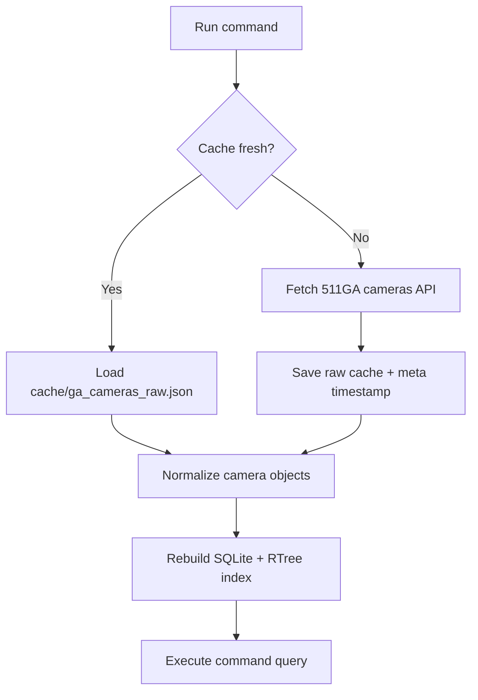
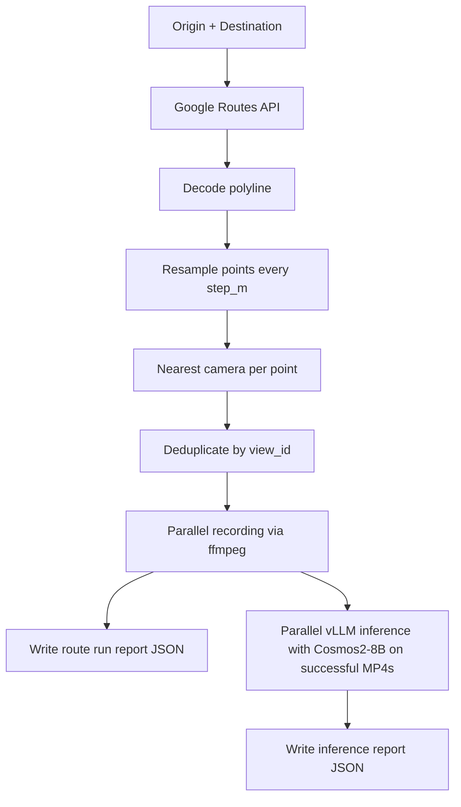

# RoadState

<p align="center">
  
</p>

CLI application for existing city & state cameras(currently only GA) that can:
- fetch/cache/index camera metadata
- run spatial queries (`search`, `bbox`, `near`)
- map cameras to a Google route (`route-cameras`)
- record route cameras to MP4 and run local vLLM inference (`route-record-infer`)

## Pipeline

### 1) Data prep pipeline (used by all camera commands)



What this means:
1. `ensure_data_ready()` checks the local cache TTL.
2. If stale/missing, it fetches from `https://511ga.org/api/v2/get/cameras`.
3. Raw JSON is normalized and indexed in `cache/ga_cameras.db` (SQLite + RTree).
4. Commands query the DB, not the API directly.

### 2) `route-record-infer` pipeline



Recording details:
1. One camera `view_id` is selected per route point (with expanding-radius nearest search).
2. Recording runs in parallel workers (default 5) with retry policy for token/session, offline, and recorder failures.
3. Only successful recordings are sent to the OpenAI-compatible vLLM endpoint.
4. Prompt comes from `--prompt` or `--prompt-yaml`.

## Requirements

- Python 3.11+
- `ffmpeg` on PATH
- Python packages:
  - `requests`
  - `PyYAML`
  - `openai`

## Recommended Hardware

- GPU: **NVIDIA H100 (required)** for local `route-record-infer` workloads with the current video model setup w/ concurrency.
- CPU: 16+ vCPU recommended.
- RAM: 64+ GB recommended.
- Storage: fast NVMe SSD recommended for concurrent recording + inference I/O.

## Setup

Recommended: use the bootstrap script.

```bash
bash scripts/bootstrap.sh
```

Set these env vars in your pod/template config before startup:
- `GA511_API_KEY` (fills `511ga_api_key.txt`) -- not needed for test. tests use previulsy pulled ga511 camera database
- `GOOGLE_ROUTES_API_KEY` (fills `google_routes_api_key.txt`)
- `HF_TOKEN=hf_xxx...` (non-interactive HF login)
- `START_VLLM=1` (auto-start vLLM on boot)

## Commands

Show command help:

```bash
python3 app.py --help
```

Sample indexed cameras:

```bash
python3 app.py sample -n 5
```

Keyword search:

```bash
python3 app.py search --q "I-75" --limit 10
```

Bounding box query:

```bash
python3 app.py bbox \
  --min-lat 33.6 --max-lat 33.9 \
  --min-lon -84.6 --max-lon -84.2 \
  --enabled-only
```

Near query:

```bash
python3 app.py near --lat 33.7490 --lon -84.3880 --radius-km 2 --enabled-only
```

Route cameras (JSON output):

```bash
python3 app.py route-cameras \
  --origin-lat 33.7489 --origin-lon -84.3881 \
  --dest-lat 33.8537 --dest-lon -84.3733 \
  --step-m 250 --mode k --k 2 --enabled-only --dedupe-global
```

Route -> record -> infer:

```bash
python3 app.py route-record-infer \
  --origin-lat 33.7489 --origin-lon -84.3881 \
  --dest-lat 33.8537 --dest-lon -84.3733 \
  --step-m 250 --seconds 8 --enabled-only \
  --prompt-yaml prompts/traffic_scene_safety.yaml \
  --vllm-server http://127.0.0.1:8000/v1 \
  --model nvidia/Cosmos-Reason2-8B \
  --preview
```

## Outputs

- `cache/ga_cameras_raw.json` and `cache/meta.json`: API cache
- `cache/ga_cameras.db`: SQLite index
- `recordings_route/*.mp4`: route recordings
- `recordings_route/route_run_*.json`: record run report
- `recordings_route/route_run_*_infer.json`: inference report
