# RoadState

<p align="center">
  
</p>

RoadState is an end-to-end CLI pipeline for autonomous route analysis. Given a set of start and end coordinates, it dynamically locates and records footage from relevant traffic cameras, then processes those clips through a local vLLM—like NVIDIA Cosmos Reason 2—to generate real-time safety inferences.

## `route-record-infer` Pipeline

```mermaid
flowchart LR
    A[Origin + Destination] --> B[Google Routes API]
    B --> C[Decode route polyline]
    C --> D[Resample points every step_m]
    D --> E[Nearest enabled camera per point]
    E --> F[Deduplicate by view_id]
    F --> G[Parallel recording via ffmpeg]
    G --> H[Write route_run_*.json]
    G --> I[Parallel vLLM inference on successful MP4s]
    I --> J[Write route_run_*_infer.json]

    classDef input fill:#E8F5E9,stroke:#2E7D32,stroke-width:2px,color:#1B5E20
    classDef external fill:#FFF8E1,stroke:#F9A825,stroke-width:2px,color:#5D4037
    classDef process fill:#E3F2FD,stroke:#1565C0,stroke-width:2px,color:#0D47A1
    classDef record fill:#FCE4EC,stroke:#C2185B,stroke-width:2px,color:#880E4F
    classDef infer fill:#EDE7F6,stroke:#5E35B1,stroke-width:2px,color:#311B92
    classDef output fill:#FFF3E0,stroke:#EF6C00,stroke-width:2px,color:#BF360C

    class A input
    class B external
    class C,D,E,F process
    class G record
    class I infer
    class H,J output
```



How it works:
1. `ensure_data_ready()` refreshes camera cache/index if TTL has expired (`https://511ga.org/api/v2/get/cameras`).
2. One camera `view_id` is selected per route point using nearest search (with expanding radius when needed).
3. Recording runs in parallel workers (default `5`) with retries for token/session, offline, and recorder failures.
4. Only successful recordings are sent to the OpenAI-compatible vLLM endpoint.
5. Prompt text comes from `--prompt` or `--prompt-yaml`.

## Requirements

- Python 3.11+
- `ffmpeg` on PATH
- Python packages:
  - `requests`
  - `PyYAML`
  - `openai`

## Recommended Hardware

- GPU: **NVIDIA H100 (required)** for local `route-record-infer` workloads with the current video model setup w/ concurrency.
- Base image: `pytorch:1.0.2-cu1281-torch280-ubuntu2404`
- CPU: 16+ vCPU recommended.
- RAM: 64+ GB recommended.
- Storage: fast NVMe SSD recommended for concurrent recording + inference I/O.

## Setup

Use the bootstrap script:

```bash
bash scripts/bootstrap.sh
```

Set these env vars before startup:
- `GA511_API_KEY` (fills `511ga_api_key.txt`; not needed for tests if cached camera DB already exists) - https://511ga.org/developers/doc
- `GOOGLE_ROUTES_API_KEY` (fills `google_routes_api_key.txt`)
- `HF_TOKEN=hf_xxx...` (non-interactive HF login)
- `START_VLLM=1` (auto-start vLLM on boot)

Google Routes API note:
- The pod/server IP address must be allowlisted in your Google API credentials/restrictions.
- You can create an API key at: `https://developers.google.com/maps`

## Command

```bash
python3 app.py route-record-infer \
  --origin-lat 33.7489 --origin-lon -84.3881 \
  --dest-lat 33.8537 --dest-lon -84.3733 \
  --step-m 250 --seconds 8 --enabled-only \
  --prompt-yaml prompts/traffic_scene_safety.yaml \
  --vllm-server http://127.0.0.1:8000/v1 \
  --model nvidia/Cosmos-Reason2-8B \
  --preview
```

## Outputs

- `cache/ga_cameras_raw.json` and `cache/meta.json`: camera API cache
- `cache/ga_cameras.db`: SQLite + RTree camera index
- `recordings_route/*.mp4`: route recordings
- `recordings_route/route_run_*.json`: record run report
- `recordings_route/route_run_*_infer.json`: inference report
